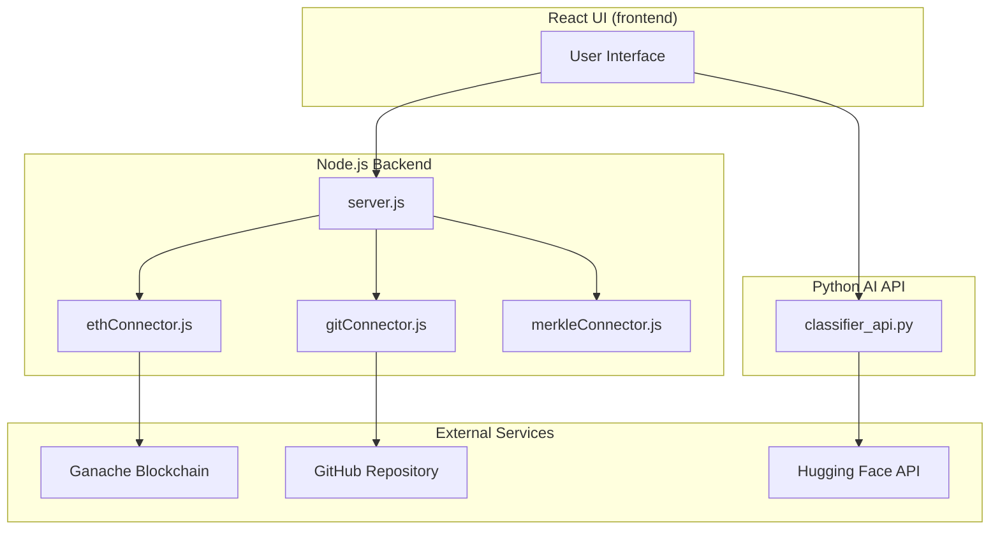
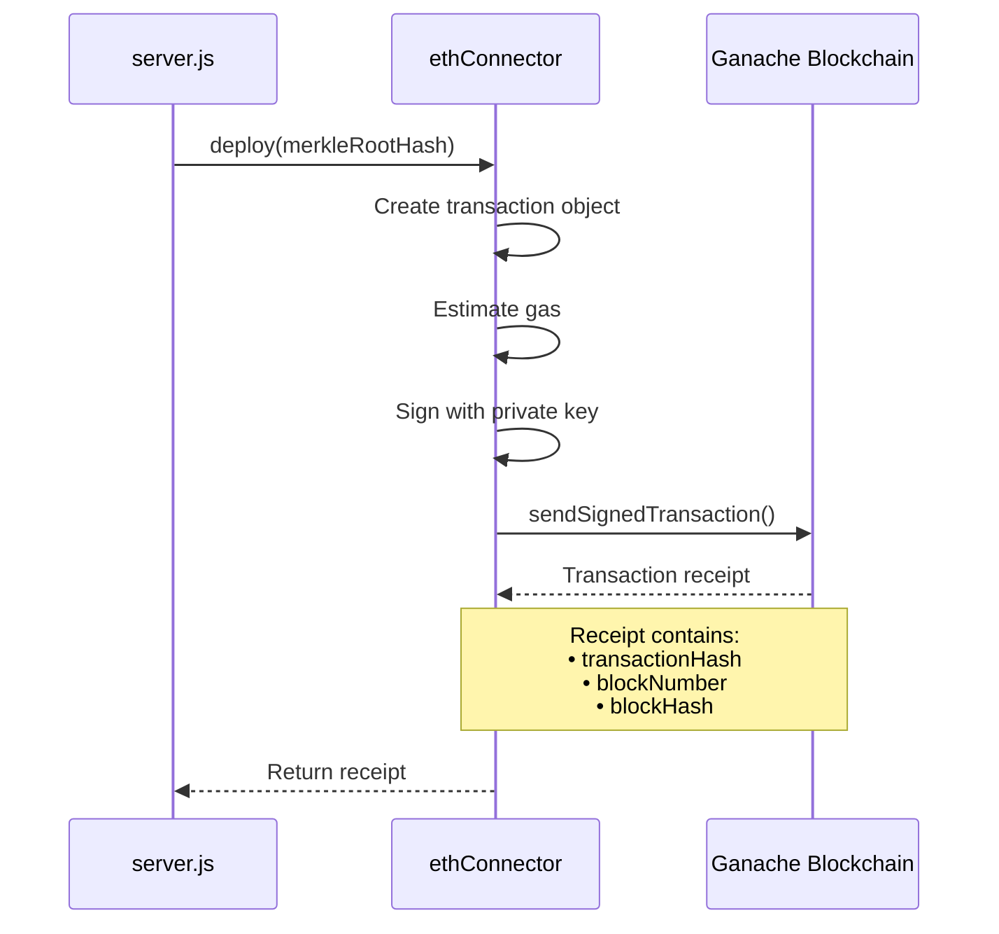
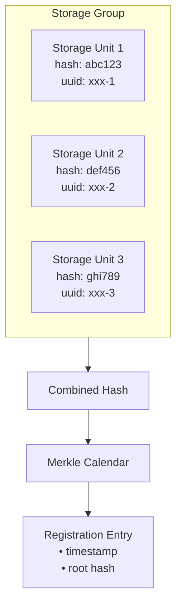
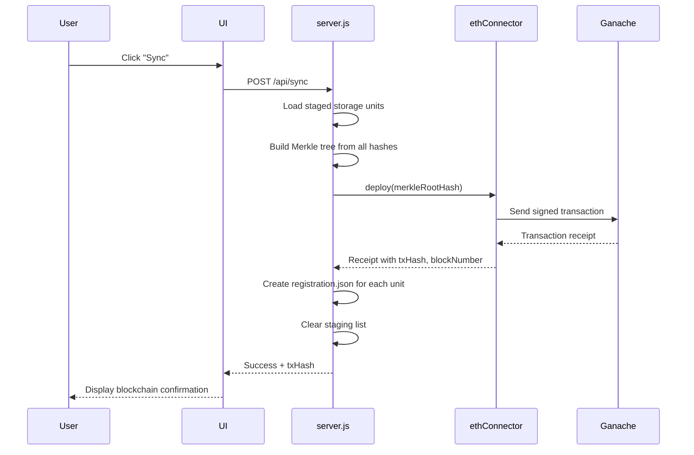
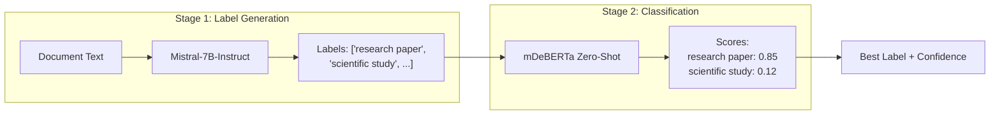

# Vericlasify - Complete Technical Documentation

> For External Instructor / Project Review

---

## 1. Project Overview

**Vericlasify** is a blockchain-based document integrity verification system with AI-powered classification. It:

1. **Registers file hashes** on an Ethereum-compatible blockchain (Ganache)
2. **Classifies documents** using a two-stage LLM pipeline (Mistral-7B → mDeBERTa)
3. **Tracks version control** with Git integration



---

## 2. Blockchain Component

### 2.1 `ethConnector.js` — Ethereum Interface

**Purpose:** Connects to an Ethereum node (Ganache) to deploy transactions containing file hash data.

#### Full Source Code:

```javascript
const Web3 = require('web3');

class EthConnector {
    #web3;
    #w1;  // Sender wallet address
    #w2;  // Receiver wallet address
    #k;   // Private key for signing

    constructor(host, w1, w2, k) {
        this.#web3 = new Web3(host); // e.g., 'HTTP://127.0.0.1:7545'
        this.#w1 = w1;
        this.#w2 = w2;
        this.#k = k;
    }

    /**
     * Deploy a hash to the blockchain
     * The merkle root hash is stored in the transaction's data field
     */
    async deploy(hashRoot) {
        const txObject = {
            from: this.#w1,
            to: this.#w2,
            data: hashRoot + ''  // Hash stored in data field
        };

        txObject.gas = await this.#web3.eth.estimateGas(txObject);

        console.log('Sending transaction from ' + this.#w1 + ' to ' + this.#w2);
        
        // Sign the transaction with private key
        const createTransaction = await this.#web3.eth.accounts.signTransaction(
            txObject, 
            this.#k
        );
        
        // Send signed transaction to blockchain
        const receipt = await this.#web3.eth.sendSignedTransaction(
            createTransaction.rawTransaction
        );
        
        return receipt;  // Contains txHash, blockNumber, blockHash
    }

    async getBlock(blockNumber) {
        return await this.#web3.eth.getBlock(blockNumber);
    }

    /**
     * Verify a hash exists in a specific block
     */
    async verifyHash(transactionHash, blockNum, root, w1) {
        const block = await this.#web3.eth.getBlock(blockNum);
        
        if (block.transactions.includes(transactionHash)) {
            const res = await this.#web3.eth.getTransaction(transactionHash);
            
            // Verify: data matches expected hash AND sender matches
            if (res.input == "0x" + root && 
                res.from.toUpperCase() == w1.toUpperCase()) {
                return [res.from.toUpperCase(), true];  // Verified
            }
        }
        return [null, false];  // Not verified
    }
}

module.exports = EthConnector;
```

#### Transaction Flow:



#### Key Concepts:

| Concept | Explanation |
|---------|-------------|
| **Data Field** | The merkle root hash is embedded in the transaction's `data` field, making it permanent on-chain |
| **Signed Transaction** | Private key signs the transaction to prove sender's identity |
| **Gas Estimation** | `estimateGas()` calculates the fee needed for the transaction |

---

### 2.2 `merkleConnector.js` — Merkle Calendar Tree

**Purpose:** Groups multiple storage units into a Merkle tree structure for efficient batch registration.

```javascript
import * as mc from 'merkle-calendar'

class MerkleConnector {
    #merkleCalendar

    constructor() {
        this.#merkleCalendar = new mc.MerkleCalendar();
    }

    /**
     * Add a registration to the Merkle Calendar
     * Groups multiple storage units under a single timestamp
     */
    addRegistration(name, hash, timestamp, closed, storageGroup, mHash, yHash) {
        let sg = new mc.StorageGroup();
        
        // Build storage group from individual units
        for (el of storageGroup) {
            let su = new mc.StorageUnit(el.hash, el.uuid);
            sg.addToSG(su);
        }
        
        // Calculate combined hash of the storage group
        sg.calculateHash();
        
        // Register in the Merkle Calendar
        this.#merkleCalendar.addRegistration(
            name, hash, timestamp, closed, sg, null, null
        );
    }
}

module.exports = MerkleConnector;
```

#### Storage Group Structure:



---

### 2.3 `server.js` — Blockchain Sync Endpoint

This is the core endpoint that registers file hashes on the blockchain:

```javascript
// POST /api/sync - Register hashes on blockchain
app.post('/api/sync', async (req, res) => {
    const { ethHost } = req.body;
    const host = ethHost || 'http://127.0.0.1:8545';

    // Step 1: Load wallet configuration
    const config = readConfig();
    if (!config || !config.wallet1) {
        return res.json({ success: false, error: 'No wallet configured.' });
    }

    // Step 2: Get staged storage units
    const sg = files.loadSG() || [];
    if (sg.length === 0) {
        return res.json({ success: false, error: 'Nothing staged.' });
    }

    // Step 3: Connect to Ethereum
    const ethLogic = require('./logic/ethLogic');
    ethLogic.connect(config.wallet1, config.wallet2, config.pkey, host);

    // Step 4: Build Merkle trees from staged units
    const mc = files.loadTree();
    const [openRoot, closedRoot, openL, closedL] = files.createSGTrees(sg);

    // Step 5: Add to Merkle Calendar and deploy to blockchain
    const today = new Date();
    const [openWitness, openSG] = ethLogic.addToTree(openRoot, mc, false, today, openL);
    const [mkcHash, receipt, bktimestamp] = await ethLogic.registerMC(mc);

    // Step 6: Create registration file for each synced unit
    for (let el of openL) {
        files.createRegistration({
            path: el.path,
            type: "synchronization",
            mkcalroot: mkcHash,
            txhash: receipt.transactionHash,  // Blockchain proof
            bkhash: receipt.blockHash,
            bkheight: receipt.blockNumber,
            bktimestamp,
            witness: openWitness,
            openstoragegroup: openSG
        });
    }

    // Step 7: Clear staging and save tree
    files.flushSG();
    files.saveTree(mc);

    res.json({
        success: true,
        data: {
            txHash: receipt.transactionHash,
            blockNumber: receipt.blockNumber,
            unitssynced: openL.length
        }
    });
});
```

#### Complete Sync Workflow:



---

### 2.4 Blockchain Verification Endpoint

```javascript
// POST /api/checkbc - Verify storage unit against blockchain
app.post('/api/checkbc', async (req, res) => {
    const { targetPath } = req.body;
    const workingDir = targetPath.trim();

    // Read last registration (contains txHash from blockchain sync)
    const reg = files.readRegistrationFile();
    const vericl = files.readVericlFile();

    // Step 1: Get current files and calculate their hash
    const currentFileList = [];
    files.getFilelist('.', currentFileList);
    const currentHash = calculateContentHash(currentFileList);

    // Step 2: Compare with registered hash (from sync time)
    const registeredHash = vericl.hash;
    const filesMatch = (currentHash === registeredHash);

    res.json({
        success: true,
        data: {
            filesMatch,
            currentHash,
            registeredHash,
            txHash: reg.txhash,         // Blockchain transaction hash
            block: reg.bkheight,         // Block number
            message: filesMatch 
                ? '✓ Files unchanged since registration' 
                : '⚠️ FILES HAVE BEEN MODIFIED!'
        }
    });
});
```

---

## 3. AI Classification Component

### 3.1 `classifier_api.py` — Document Classification API

**Purpose:** Classifies uploaded documents using a two-stage AI pipeline with Hugging Face models.

#### Architecture:



#### Full Classification Logic:

```python
"""
Two-stage pipeline: Mistral-7B → mDeBERTa
"""

# Models used
MISTRAL_MODEL = "mistralai/Mistral-7B-Instruct-v0.2"      # Label generator
MDEBERTA_MODEL = "MoritzLaurer/mDeBERTa-v3-base-xnli-multilingual-nli-2mil7"  # Classifier

def generate_labels(client, text, retry=True):
    """
    Stage 1: Use Mistral-7B to generate 3-5 category labels
    """
    system_prompt = """You are a document classification expert. 
    Analyze document text and generate exactly 3 to 5 high-level category labels.
    
    RULES:
    - Labels must be short noun phrases (e.g., "research paper", "invoice")
    - Output ONLY a valid JSON array of strings
    - No explanations, no markdown
    - Example: ["research paper", "scientific study", "academic publication"]"""
    
    user_prompt = f"""DOCUMENT TEXT:
    {text[:30000]}
    
    OUTPUT JSON ARRAY:"""
    
    response = client.chat_completion(
        messages=[
            {"role": "system", "content": system_prompt},
            {"role": "user", "content": user_prompt}
        ],
        model=MISTRAL_MODEL,
        max_tokens=128,
        temperature=0.3  # Low temperature for consistent output
    )
    
    # Parse JSON array from response
    content = response.choices[0].message.content
    match = re.search(r'\[.*?\]', content, re.DOTALL)
    if match:
        labels = json.loads(match.group())
        return labels[:5]
    
    # Fallback labels if parsing fails
    return ["document", "text file", "general content"]


def classify_with_labels(client, text, labels):
    """
    Stage 2: Use mDeBERTa for zero-shot classification
    """
    classifier_text = text[:3000]  # Limit for classifier
    
    # Call Hugging Face inference API directly
    API_URL = f"https://router.huggingface.co/hf-inference/models/{MDEBERTA_MODEL}"
    headers = {"Authorization": f"Bearer {HF_TOKEN}"}
    
    payload = {
        "inputs": classifier_text,
        "parameters": {"candidate_labels": labels}
    }
    
    response = requests.post(API_URL, headers=headers, json=payload)
    result = response.json()
    
    # Parse scores: {"labels": [...], "scores": [...]}
    scores = {}
    for label, score in zip(result["labels"], result["scores"]):
        scores[label] = round(float(score), 4)
    
    return scores  # e.g., {"research paper": 0.85, "invoice": 0.12}
```

#### API Endpoints:

```python
@app.route("/api/classify", methods=["POST"])
def api_classify():
    """
    Upload a file, get classification result
    """
    file = request.files["file"]
    filename = secure_filename(file.filename)
    file_path = UPLOAD_FOLDER / filename
    file.save(file_path)
    
    try:
        client = InferenceClient(token=HF_TOKEN)
        
        # Extract text from PDF/DOCX/TXT
        text = extract_text(file_path)
        
        # Stage 1: Generate labels
        labels = generate_labels(client, text)
        
        # Stage 2: Classify against labels
        scores = classify_with_labels(client, text, labels)
        
        # Return best match
        best_label = max(scores, key=scores.get)
        return jsonify({
            "label": best_label,
            "confidence": scores[best_label],
            "all_scores": scores
        })
    finally:
        file_path.unlink()  # Clean up uploaded file


@app.route("/api/classify/stream", methods=["POST"])
def api_classify_stream():
    """
    Streaming endpoint - shows progress in real-time
    Uses Server-Sent Events (SSE)
    """
    def generate():
        # Stage 1: Extract text
        yield f"data: {json.dumps({'stage': 'extract', 'status': 'running'})}\n\n"
        text = extract_text(file_path)
        yield f"data: {json.dumps({'stage': 'extract', 'status': 'complete'})}\n\n"
        
        # Stage 2: Generate labels
        yield f"data: {json.dumps({'stage': 'labels', 'status': 'running'})}\n\n"
        labels = generate_labels(client, text)
        yield f"data: {json.dumps({'stage': 'labels', 'labels': labels})}\n\n"
        
        # Stage 3: Classify
        yield f"data: {json.dumps({'stage': 'classify', 'status': 'running'})}\n\n"
        scores = classify_with_labels(client, text, labels)
        best_label = max(scores, key=scores.get)
        
        yield f"data: {json.dumps({
            'stage': 'complete',
            'label': best_label,
            'confidence': scores[best_label],
            'all_scores': scores
        })}\n\n"
    
    return Response(generate(), mimetype="text/event-stream")
```

#### Text Extraction:

```python
def extract_text(file_path):
    """Extract text from different file types"""
    ext = file_path.suffix.lower()
    
    if ext == ".pdf":
        with pdfplumber.open(file_path) as pdf:
            text_parts = []
            for page in pdf.pages:
                page_text = page.extract_text()
                if page_text:
                    text_parts.append(page_text)
        return "\n".join(text_parts)
    
    elif ext == ".docx":
        doc = Document(file_path)
        paragraphs = [p.text for p in doc.paragraphs if p.text.strip()]
        return "\n".join(paragraphs)
    
    elif ext in [".txt", ".md"]:
        with open(file_path, "r", encoding="utf-8") as f:
            return f.read()
    
    return ""
```

---

## 4. Git Integration

### 4.1 `gitConnector.js` — Version Control

```javascript
const simpleGit = require('simple-git');

class GitConnector {
    #git;
    #dir;

    constructor(dir) {
        this.#dir = dir;
        this.#git = simpleGit(dir);
    }

    async init() {
        // Initialize repo if it doesn't exist
        if (!fs.existsSync(path.join(this.#dir, '.git'))) {
            await this.#git.init();
        }
        await this.#git.fetch();
    }

    async add(files = './*') {
        await this.#git.add(files);
    }

    async commit(msg) {
        const log = await this.#git.log();
        const commitNum = log.total + 1;
        const message = msg || `commit #${commitNum} by Vericlasify`;
        await this.#git.commit(message);
    }

    async push() {
        await this.#git.push('origin', 'master');
    }

    async pull() {
        await this.#git.pull();
    }

    async addRemote(url) {
        await this.#git.addRemote('origin', url);
    }

    async getRemote() {
        const remotes = await this.#git.getRemotes(true);
        const origin = remotes.find(r => r.name === 'origin');
        return origin ? origin.refs.fetch : null;
    }
}

module.exports = GitConnector;
```

---

## 5. Data Files

### `.vericl/config.json` — Storage Unit Configuration

```json
{
    "header": {
        "uuid": "550e8400-e29b-41d4-a716-446655440000",
        "name": "My Project",
        "description": "Project files",
        "remote": "https://github.com/user/repo",
        "created": "2026-01-01T00:00:00Z",
        "mdtime": "2026-01-02T12:30:00Z"
    },
    "filelist": ["./src/main.js", "./README.md", "./package.json"],
    "fileHashes": {
        "./src/main.js": "a1b2c3d4e5f6...",
        "./README.md": "b2c3d4e5f6a1...",
        "./package.json": "c3d4e5f6a1b2..."
    },
    "hash": "abc123def456...",
    "offhash": {
        "closed": false
    }
}
```

### `.vericl/registration.json` — Blockchain Proof

```json
{
    "type": "synchronization",
    "txhash": "0x1234567890abcdef...",
    "bkhash": "0xabcdef1234567890...",
    "bkheight": 42,
    "bktimestamp": "2026-01-01T00:00:00Z",
    "mkcalroot": "fedcba0987654321...",
    "witness": ["proof", "path", "nodes"],
    "openstoragegroup": [
        {"uuid": "xxx-1", "hash": "abc123"},
        {"uuid": "xxx-2", "hash": "def456"}
    ]
}
```

---

## 6. File Structure Summary

```
Vericlasify/
├── server.js              # Main Express API (Node.js backend)
├── classifier_api.py      # AI Classification API (Python Flask)
├── connectors/
│   ├── ethConnector.js    # Ethereum/Ganache blockchain interface
│   ├── gitConnector.js    # Git operations wrapper
│   └── merkleConnector.js # Merkle tree management
├── lib/
│   ├── files.js           # File system utilities
│   └── encryption.js      # AES-256-GCM file encryption
├── logic/
│   ├── ethLogic.js        # Blockchain business logic
│   └── gitLogic.js        # Git business logic
├── ui/                    # React frontend
├── .env                   # Environment variables (HF_TOKEN, etc.)
└── config.json            # Wallet configuration
```

---

## 7. Quick Reference — Key Technologies

| Component | Technology | Purpose |
|-----------|------------|---------|
| Backend API | Express.js (Node.js) | REST API, orchestration |
| Blockchain | Web3.js + Ganache | Hash registration, verification |
| AI Labels | Mistral-7B (Hugging Face) | Generate document categories |
| AI Classify | mDeBERTa Zero-Shot | Score documents against labels |
| Text Extraction | pdfplumber, python-docx | Extract text from PDF/DOCX |
| Version Control | simple-git | Git automation |
| File Hashing | SHA-256 (crypto) | Content integrity |
| Encryption | AES-256-GCM | Optional file encryption |

---

## 8. Security Model

1. **Content-Based Hashing:** SHA-256 on actual file contents, not filenames
2. **Individual File Tracking:** Per-file hashes for granular verification
3. **Blockchain Immutability:** Once synced, hash is permanent on-chain
4. **Signed Transactions:** Private key proves sender identity
5. **Server Protection:** `isServerDirectory()` prevents accidental deletion
