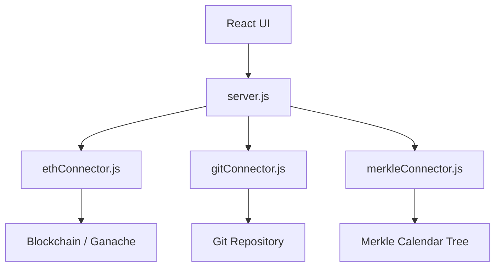
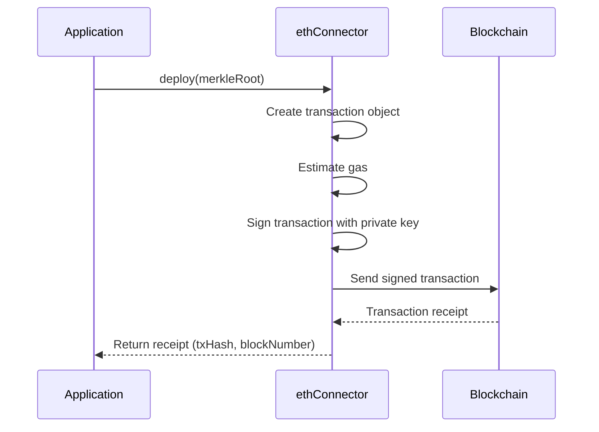
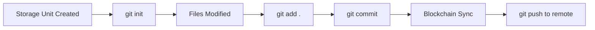
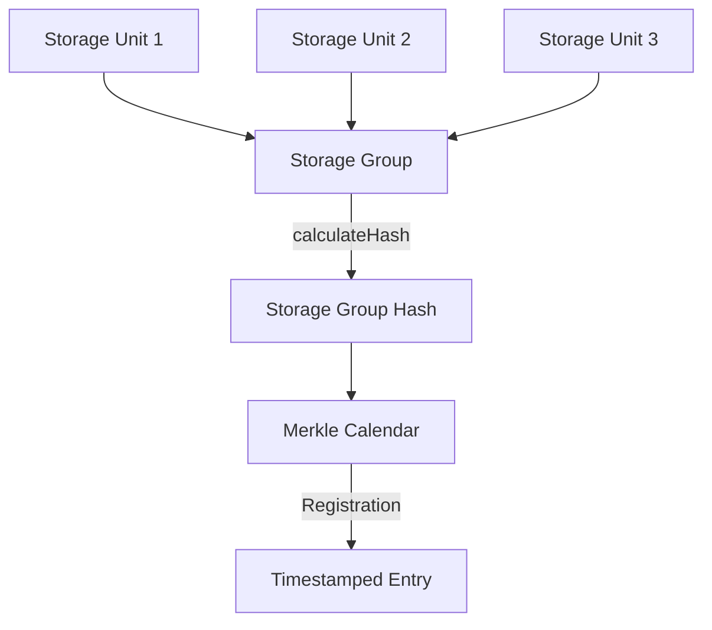
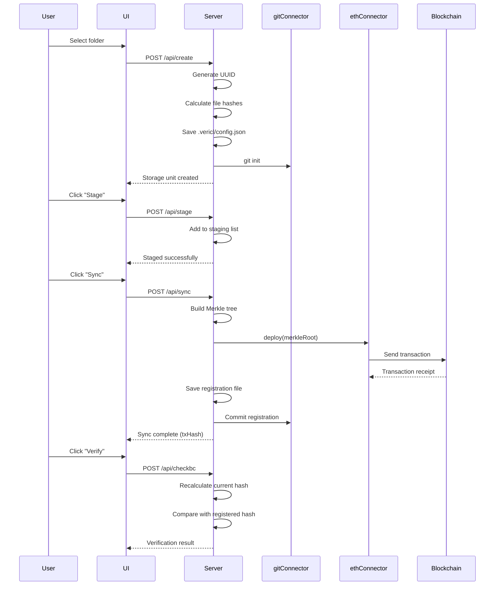

# Vericlasify - Code Architecture & Explanation

This document explains each core file in the Vericlasify project and how they work together.

---

## System Overview



---

## 📁 Connectors Directory

### 1. `ethConnector.js` — Ethereum Blockchain Interface

**Purpose:** Bridge between the application and Ethereum blockchain (or Ganache testnet).

#### Class: `EthConnector`

```javascript
constructor(host, w1, w2, k)
```
| Parameter | Description |
|-----------|-------------|
| `host` | RPC URL (e.g., `http://127.0.0.1:7545`) |
| `w1` | Sender wallet address |
| `w2` | Receiver wallet address |
| `k` | Private key for signing transactions |

#### Methods

| Method | Description |
|--------|-------------|
| `deploy(hashRoot)` | Sends a signed transaction embedding `hashRoot` in the data field. Returns transaction receipt. |
| `getBlock(blockNumber)` | Retrieves block data by block number. |
| `verifyHash(txHash, blockNum, root, w1)` | Verifies if a transaction exists in the block and matches the expected hash and sender. |

#### How It Works



---

### 2. `gitConnector.js` — Git Operations Wrapper

**Purpose:** Automates Git version control for storage units using `simple-git`.

#### Class: `GitConnector`

```javascript
constructor(dir)  // Initialize git in directory
```

#### Methods

| Method | Description |
|--------|-------------|
| `init()` | Initializes git repo if not exists, then fetches |
| `add(_arg)` | Stages specific files |
| `add()` | Stages all files (`'./*'`) |
| `commit(_msg, _enmsg)` | Commits with auto-generated message: `"commit #N by Vericlasify"` |
| `getRepoFiles()` | Lists all tracked files in repo |
| `addRemote(_repo)` | Adds origin remote URL |
| `push()` | Pushes to `origin/master` |
| `pull()` | Pulls from remote |
| `reset()` | Hard reset to `HEAD~1` |
| `log()` | Returns git commit log |
| `hasRemote()` | Checks if remote is configured |
| `getRemote()` | Returns current remote URL |
| `setRemote(url)` | Sets remote URL |
| `custom(_commands)` | Executes arbitrary git commands |

#### How It Works



---

### 3. `merkleConnector.js` — Merkle Calendar Integration

**Purpose:** Manages timestamping and grouping of storage units using a Merkle Calendar structure.

#### Class: `MerkleConnector`

```javascript
constructor()  // Creates new MerkleCalendar instance
```

#### Methods

| Method | Description |
|--------|-------------|
| `addRegistration(name, hash, timestamp, closed, storageGroup, mHash, yHash)` | Adds a registration entry to the Merkle Calendar |

#### How It Works



**Storage Group Construction:**
1. For each element in `storageGroup`, create a `StorageUnit` with hash and UUID
2. Add each unit to the `StorageGroup`
3. Calculate combined hash of the group
4. Add registration to Merkle Calendar with all metadata

---

## 📄 `server.js` — Express API Backend

**Purpose:** Main REST API server that orchestrates all operations.

### Configuration

| Variable | Default | Description |
|----------|---------|-------------|
| `PORT` | 3001 | Server port |
| `SERVER_DIR` | `__dirname` | Server directory (protected from operations) |

### Helper Functions

#### `calculateContentHash(fileList)`
Computes a combined SHA-256 hash of all file contents.

#### `calculateContentHashWithDetails(fileList)`
Returns both combined hash AND individual file hashes for per-file verification.

```javascript
{
  combinedHash: "abc123...",
  fileHashes: {
    "./file1.txt": "hash1...",
    "./file2.js": "hash2..."
  }
}
```

#### `isServerDirectory(path)`
Safety check preventing operations on server directory.

---

### API Endpoints

#### Wallet Management

| Endpoint | Method | Description |
|----------|--------|-------------|
| `/api/wallet/connect` | POST | Connect to Ethereum node, retrieve accounts |
| `/api/wallet/status` | GET | Get current wallet connection status |

#### Storage Unit Operations

| Endpoint | Method | Description |
|----------|--------|-------------|
| `/api/create` | POST | Create new storage unit with UUID and file hashes |
| `/api/listfiles` | POST | List all files in a storage unit |
| `/api/update` | POST | Recalculate hashes after file modifications |
| `/api/stage` | POST | Stage storage unit for blockchain sync |

#### Blockchain Operations

| Endpoint | Method | Description |
|----------|--------|-------------|
| `/api/sync` | POST | Register hashes on blockchain |
| `/api/checkbc` | POST | Verify storage unit against blockchain |
| `/api/checkfile` | POST | Check individual file integrity |

#### Git Operations

| Endpoint | Method | Description |
|----------|--------|-------------|
| `/api/get-remote` | POST | Get configured remote URL |
| `/api/git/push` | POST | Push to remote repository |
| `/api/git/pull` | POST | Pull from remote |

---

### Complete Workflow



---

## Data Files

### `.vericl/config.json`
Main storage unit configuration.

```json
{
  "header": {
    "uuid": "unique-id",
    "name": "Storage Unit Name",
    "description": "Description",
    "remote": "https://github.com/user/repo",
    "created": "2026-01-01T00:00:00Z",
    "mdtime": "2026-01-02T00:00:00Z"
  },
  "filelist": ["./file1.txt", "./file2.js"],
  "fileHashes": {
    "./file1.txt": "sha256-hash-1",
    "./file2.js": "sha256-hash-2"
  },
  "hash": "combined-merkle-root",
  "offhash": {
    "closed": false
  }
}
```

### `.vericl/registration.json`
Blockchain registration proof.

```json
{
  "type": "synchronization",
  "txhash": "0x...",
  "bkhash": "0x...",
  "bkheight": 123,
  "bktimestamp": "2026-01-01T00:00:00Z",
  "mkcalroot": "merkle-calendar-root",
  "witness": ["proof", "path"],
  "openstoragegroup": [...]
}
```

---

## Security Considerations

1. **Server Directory Protection:** `isServerDirectory()` prevents accidental deletion of server files.
2. **Content-Based Hashing:** Uses SHA-256 on actual file contents, not just filenames.
3. **Individual File Tracking:** Stores per-file hashes for granular integrity verification.
4. **Blockchain Immutability:** Once synced, the hash is permanently recorded on-chain.

---

## Quick Reference

| Component | File | Key Responsibility |
|-----------|------|-------------------|
| API Server | `server.js` | REST endpoints, orchestration |
| Blockchain | `ethConnector.js` | Transaction handling |
| Version Control | `gitConnector.js` | Git automation |
| Timestamping | `merkleConnector.js` | Merkle tree management |
